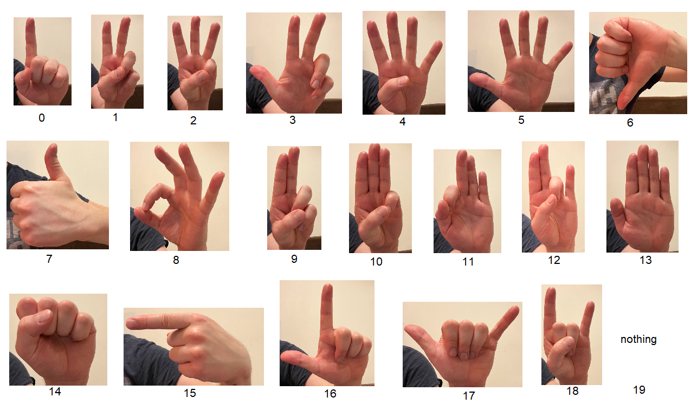

# GestRec

This library aims to allow developers to easily integrate gesture recognition and gesture control in their applications by providing plug-and-play model for recognizing a fixed set of gestures.

# How to use

Using the library is as simple as defining the Recognizer object and passing a PIL image to its ``__call__`` function:

    rec = Recognizer()
    rec(image)

The library supports recognition of the following set of gestures:

# Docs

You can find the library documentation [here](https://gestrec.readthedocs.io/en/latest/index.html).
