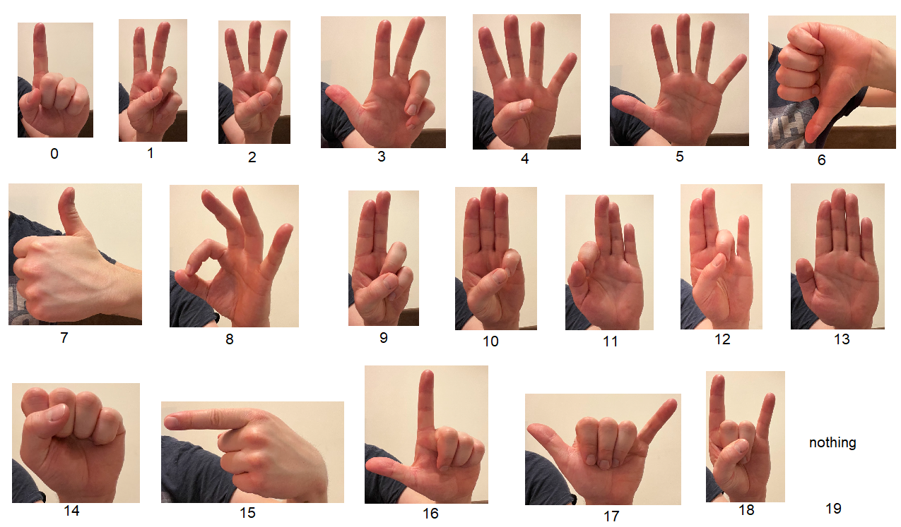

Getting Started
===============

Installation
------------

Begin by cloning the repository from `github <https://github.com/witolddebski/gestRec/tree/master>`_.

Classifying Gestures
--------------------

To use GestRec, import the package and create the ``Recognizer`` object:

.. code-block:: python

   >>> import gestrec
   >>> rec = gestrec.Recognizer()

The default model loaded is MobileNetV3-Large [1]_. Next, all you need is an image
to be processed. A test image is supplied with this package:

.. code-block:: python

    >>> from PIL import Image
    >>> image = Image.open("test_images/16.jpg")

This image is already flipped horizontally, but all your analyzed images need to be flipped horizontally.

Then, use the ``__call__`` method to perform inference:

.. code-block:: python

    >>> rec(image)
    16

The integer returned is the ID of the gesture, as per the following image.

    Gestures (classes) of the library with their IDs.

Since the result is an integer, you can easily map it to a custom set of labels, like so:

.. code-block:: python

    >>> labels = ["1", "2", "3", "3_alt", "4", "5", "thumbs_down",
    ...           "thumbs_up", "ok", "salute", "4_down", "1_down",
    ...           "3_down", "stop", "fist", "delete", "L", "Y",
    ...           "rock", "none"]
    >>> labels[rec(image)]
    "L"

To check how the recognition performs in your lighting conditions, you can run the showcase app:

.. code-block:: python

    >>> import gestrec.showcase as showcase
    >>> cam = showcase.Camera()
    >>> cam.launch()

This app uses OpenCV to get the image from the camera, you may use it as a starting point for your app.

The kiosk app that is also bundled with this library, shows a practical application of the library in form
of a simple vending machine application.

-----

.. [1] Howard, Andrew, Mark Sandler, Grace Chu, Liang-Chieh Chen, Bo Chen, Mingxing Tan, Weijun Wang et al.
       "Searching for mobilenetv3." In Proceedings of the IEEE/CVF international conference on computer vision,
       pp. 1314-1324. 2019.